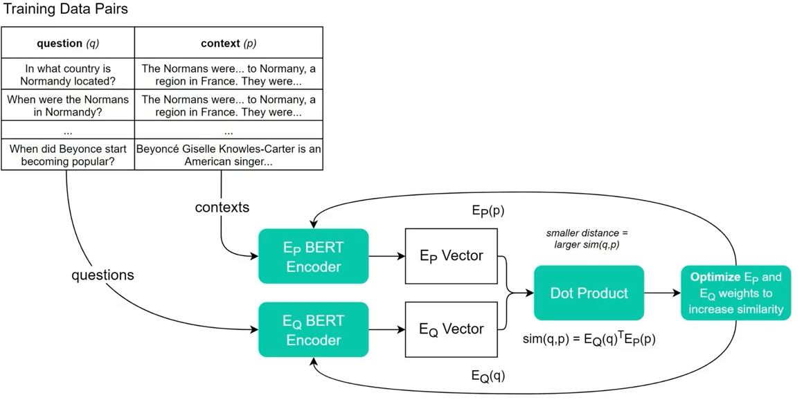
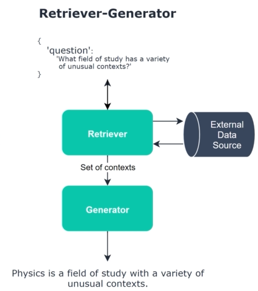

# Project

# Part 2

## Training of DPR

THe following notebook trains the DPR into the SQUAD dataset.

After training, we yield a loss of 1.09.

# Part 3

The following notebook trains the our architecture.

This notebook uses the haystack library which has built-in support for things like FAISS, DPR, and RAG.

Three components of capstone
- FAISS
- DPR
- RAG

# FAISS

FAISS stands for Facebook AI Similariy Search.

It works by calculating the distance between the query vector and the existing documents' vector. 

Components/Features of FAISS:
- Efficient GPU implementation
- Preprocessing
    - PCA
    - L2 Normalization
- Inverted file indexing (IVF)
- Quantization

# DPR

DPR stands for Dense Passage Retrieval. It is a retreiver that uses dense vectors (hence the name)

## Disadvantages
Although DPR performs better than other techniques,
- it has to be trained
- it doesn't perform well with out-of-vocabulary words
- requires signigficant computations

## How DPR Works?
It uses two transformers (BERT models) to calculate the similairty between two inputs - the question and the context. Training ensures that the correct pair ends up having the smaller 'distance' (and hence the highes similarity)

# RAG

RAG stands for Retrieval Augmented Generation.

It uses external documents to augment its knowledge.

# A simplified picture of Our Architecture

In our case
- the retriever is the DPR
- external data source is implemented using FAISS
- the Generator is the RAG architecture